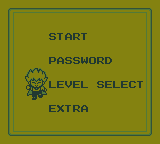
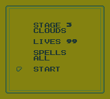
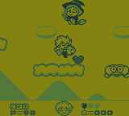
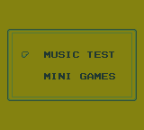

# Kid Dracula - Level Select

A quality-of-life ROM hack for **Kid Dracula** on Nintendo Game Boy.

## Features

- Expands the title menu with **LEVEL SELECT** and **EXTRA** while retaining the original **START** and **PASSWORD** modes.
- Select any of the game's eight stages, each shown with a concise descriptive name.
- Choose **01**, **03**, **05**, **09**, or **99** starting lives.
- Use the normal spell progression with **DEFAULT**, or begin with all seven legitimate spells using **ALL**.
- Press **Start** anywhere on the Level Select screen to begin immediately with the current settings.
- Access the original **MUSIC TEST** and **MINI GAMES** modes from the visible EXTRA menu.
- Return naturally between menus with **B**; choosing **NONE** in MINI GAMES returns to EXTRA.
- Preserves the original password and game-over password flow.

## Level Select controls

- **Up/Down:** Choose a setting
- **Left/Right:** Change its value
- **A on START:** Begin the selected stage
- **Start anywhere:** Begin with the current settings
- **B:** Return to the title menu

## Patching

No game ROM is included. Apply either patch to a clean copy of the required ROM. The BPS patch is recommended because it validates the source ROM before patching; IPS is supplied as an alternative.

Required ROM: `Kid Dracula (USA, Europe).gb`

| Hash | Value |
|---|---|
| CRC32 | `F27294B7` |
| MD5 | `24A6B4457A511CC667E9AC25417401AB` |
| SHA-1 | `F186833A2CCEC808210EB4BA669F08401F950E23` |
| SHA-256 | `B0A1019B6199C923A6A764C15E7BF6D1BB0BEF8A042C383F3E3EAD74AB171EDE` |

## Screenshots

| Level Select | Gameplay | Extra |
|---|---|---|
|  |  |  |

## Notes

- The stage subtitles are descriptive labels created for this hack; the original game does not provide official stage names.
- The **LIVES** value counts the current attempt. The in-game P counter displays reserve lives, so it shows one less.
- Mini-game coins and extra lives do not carry into a subsequently started main game, matching the original behavior.

## Release

Version 1.0 — September 24, 2026

Created by **wavedout**.

Kid Dracula and all original game content are property of their respective owners. This fan-made patch is distributed without a game ROM.
